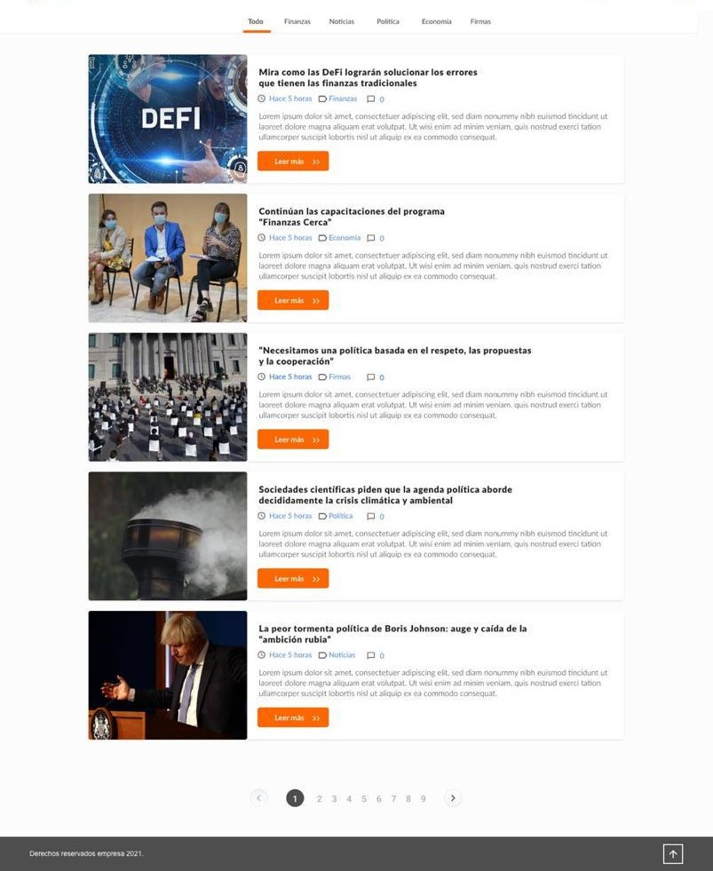

# Wordpress Dev Interview

## The requeriment:

Develop a local WordPress blog website using the latest version of WordPress, Elementor and Astra. The site will feature articles, and this expected design.
The design should match the following design as closely as possible, however the colors, fonts, and animations are up to the developer's discretion. This test is designed to be completed in no more than 1 hour and 30 minutes. The time begins to run after the initial installation of WordPress on your local server. It is recommended to have XAMPP, WAMP, MAMP, Laragon, or your preferred toolset installed to complete this test.

#### The website should be structured as follows:

- The Homepage will display a list of all created articles in descending order by publication date, with its respective pagination. (You must create at least 10 dummy articles.)
- Articles will be composed of the following fields:
    - Title
    - Image
    - Categories: An article can have more than one category.
    - Content (excerpt of the text, author, and date of article creation.)
    - Top bar that will display the created categories. It can be considered as a header or navigation menu. (When pressing on any of the buttons, it should filter the articles by their category.)
- Article detail or single page, the design to follow can be found on page 3. On this page, the detailed information of the selected article will be displayed, as well as the possibility to navigate to the next or previous one.
- The website should have a footer with the developer's data.

